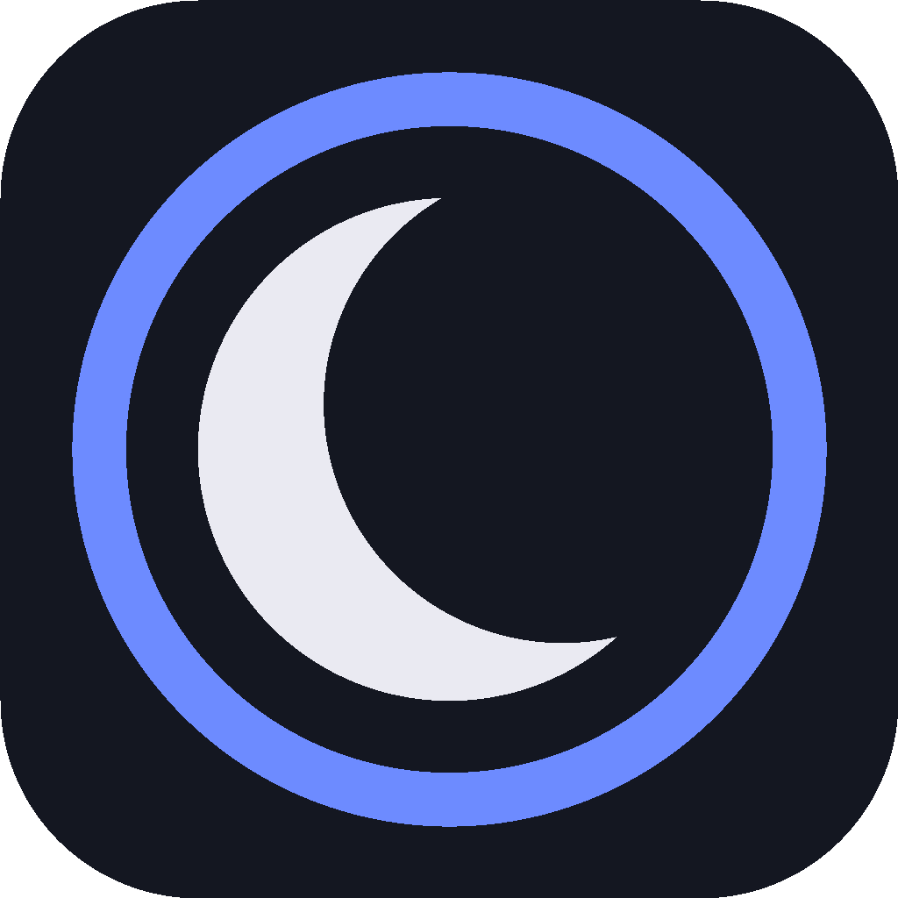

# SleepSwitch

<p align="center">
  
</p>

<p align="center">
  <strong>One switch to keep your laptop awake while AI agents, builds, downloads, renders, and backups keep running.</strong>
</p>

<p align="center">
  <a href="https://github.com/lutikk/SleepSwitch/releases/latest">Download latest release</a>
  ·
  <a href="#english">English</a>
  ·
  <a href="#русский">Русский</a>
</p>

<p align="center">
  
  
  
  
  
</p>

---

## English

SleepSwitch is a tiny open-source desktop app for people who leave long-running work unattended.

If Claude Code, Codex, Cursor, Aider, a local ML job, an Xcode build, a Docker pull, a Blender render, or a backup is still running, your laptop should not quietly fall asleep halfway through it.

SleepSwitch gives you one obvious control:

- **Prevent Sleep** — keep the machine awake when the lid is closed.
- **Allow Sleep** — return to the system's normal sleep behavior.

No profiles. No subscription. No background service to learn. Just the switch you wanted before typing another `sudo pmset` command.

### Why

macOS already has the low-level knob:

```bash
sudo pmset -a disablesleep 1
```

That works, but it is annoying to remember, annoying to reverse, and macOS asks for an administrator password every time.

SleepSwitch wraps that workflow in a small GUI:

- clear current state;
- one-click toggle;
- optional passwordless mode via a validated `sudoers` rule;
- built-in GitHub Releases update check;
- Windows tray version for lid-close power settings.

### Good For

- **AI coding agents** — keep Claude Code, Codex, Cursor, Aider, or other agents running overnight.
- **Local ML and data jobs** — training, fine-tuning, embeddings, long inference runs.
- **Large downloads** — model weights, Steam/Epic installs, torrents, Docker pulls.
- **Builds and renders** — Xcode, Gradle, CI runners, Blender, Final Cut, DaVinci Resolve.
- **Home-server laptops** — an old MacBook or Windows laptop running services with the lid closed.
- **Backups and sync** — Time Machine, iCloud, Arq, Backblaze, large file transfers.

### How It Works

On macOS, SleepSwitch controls the system `pmset disablesleep` setting:

```bash
pmset -a disablesleep 1 # Prevent Sleep
pmset -a disablesleep 0 # Allow Sleep
```

By default, macOS asks for an administrator password on every toggle. Click **Set Up Passwordless** once and SleepSwitch writes a narrow NOPASSWD rule to:

```text
/etc/sudoers.d/sleepswitch
```

The rule is validated with `visudo` before it goes live and can be removed from the app at any time.

SleepSwitch also checks GitHub Releases at startup and via **Check for Updates**. If a newer DMG is available, it downloads it, replaces the app bundle, and relaunches.

### Install

1. Download the latest `SleepSwitch-X.Y.Z.dmg` from [Releases](https://github.com/lutikk/SleepSwitch/releases/latest).
2. Open the DMG and drag **SleepSwitch** to **Applications**.
3. First launch: right-click `SleepSwitch.app` in `/Applications` and choose **Open**.
4. Click the toggle and enter your administrator password when macOS asks.
5. Optional: click **Set Up Passwordless** to make future toggles instant.

The macOS build is universal and runs on Apple Silicon and Intel Macs.

### Windows

On Windows, SleepSwitch lives in the system tray. Right-click the icon to **Prevent Sleep** or **Allow Sleep**, or open the small status window.

The Windows version changes the lid-close action through `powercfg` for both AC and DC power:

```cmd
powercfg /setacvalueindex SCHEME_CURRENT SUB_BUTTONS LIDACTION 0
powercfg /setdcvalueindex SCHEME_CURRENT SUB_BUTTONS LIDACTION 0
powercfg /setactive SCHEME_CURRENT
```

In the current release, Windows shows UAC on each toggle. A Task Scheduler-based passwordless mode is planned.

### Build From Source

Requirements:

- Go 1.22+
- Fyne CLI
- Cgo and system OpenGL on macOS

Install Fyne:

```bash
go install fyne.io/tools/cmd/fyne@latest
```

Build a macOS app:

```bash
fyne package -os darwin -name SleepSwitch --appID com.luciferdennica.sleepswitch -icon assets/icon.png -src ./cmd/sleepswitch
```

Build a universal macOS binary:

```bash
CGO_ENABLED=1 GOOS=darwin GOARCH=arm64 CC="clang -arch arm64"   go build -o build/ss-arm64 ./cmd/sleepswitch
CGO_ENABLED=1 GOOS=darwin GOARCH=amd64 CC="clang -arch x86_64"  go build -o build/ss-amd64 ./cmd/sleepswitch
lipo -create -output build/SleepSwitch.app/Contents/MacOS/sleepswitch build/ss-arm64 build/ss-amd64
```

Build on Windows:

```cmd
go install fyne.io/tools/cmd/fyne@latest
fyne package -os windows -name SleepSwitch -appID com.luciferdennica.sleepswitch ^
  -icon assets\icon.png -src .\cmd\sleepswitch -release
move SleepSwitch.exe build\
```

Build the Windows installer with Inno Setup 6:

```cmd
"C:\Program Files (x86)\Inno Setup 6\ISCC.exe" installer\SleepSwitch.iss
```

The installer is written to `build\` as `SleepSwitch-X.Y.Z-Setup.exe`.

### Project Status

SleepSwitch is intentionally small. The goal is to stay boring, inspectable, and useful:

- no account;
- no telemetry;
- no cloud dependency;
- open-source implementation;
- reversible system changes.

### License

MIT — see [LICENSE](LICENSE).

---

## Русский

SleepSwitch — маленькое open-source приложение для тех, кто оставляет долгие задачи работать без присмотра.

Если Claude Code, Codex, Cursor, Aider, локальная ML-задача, Xcode-сборка, Docker pull, Blender-рендер или бэкап всё ещё работает, ноутбук не должен тихо уснуть посреди процесса.

SleepSwitch даёт один понятный переключатель:

- **Запретить сон** — держать машину активной при закрытой крышке.
- **Разрешить сон** — вернуть обычное поведение системы.

Без профилей, подписок и сложных настроек. Просто кнопка, которую хочется иметь перед очередным `sudo pmset`.

### Зачем

В macOS уже есть низкоуровневая команда:

```bash
sudo pmset -a disablesleep 1
```

Она работает, но её неудобно помнить, неудобно откатывать, и macOS каждый раз спрашивает пароль администратора.

SleepSwitch превращает это в маленький GUI:

- понятный текущий статус;
- переключение одной кнопкой;
- опциональный режим без пароля через проверенное `sudoers`-правило;
- проверка обновлений через GitHub Releases;
- Windows-версия в трее для настройки поведения крышки.

### Кому Подойдёт

- **AI coding agents** — оставить Claude Code, Codex, Cursor, Aider или другого агента работать на ночь.
- **Локальный ML и data-задачи** — training, fine-tuning, embeddings, долгий inference.
- **Большие загрузки** — веса моделей, Steam/Epic, торренты, Docker pulls.
- **Сборки и рендеры** — Xcode, Gradle, локальный CI, Blender, Final Cut, DaVinci Resolve.
- **Домашний сервер из ноутбука** — старый MacBook или Windows-ноут с закрытой крышкой.
- **Бэкапы и синхронизация** — Time Machine, iCloud, Arq, Backblaze, большие переносы файлов.

### Как Это Работает

На macOS SleepSwitch управляет системной настройкой `pmset disablesleep`:

```bash
pmset -a disablesleep 1 # Запретить сон
pmset -a disablesleep 0 # Разрешить сон
```

По умолчанию macOS спрашивает пароль администратора на каждое переключение. Кнопка **Настроить без пароля** один раз добавляет узкое NOPASSWD-правило в:

```text
/etc/sudoers.d/sleepswitch
```

Правило проверяется через `visudo` перед установкой. Удалить его можно из приложения в любой момент.

SleepSwitch также проверяет GitHub Releases при старте и по кнопке **Проверить обновления**. Если доступен новый DMG, приложение скачивает его, заменяет текущий бандл и перезапускается.

### Установка

1. Скачай свежий `SleepSwitch-X.Y.Z.dmg` со страницы [Releases](https://github.com/lutikk/SleepSwitch/releases/latest).
2. Открой DMG и перетащи **SleepSwitch** в **Applications**.
3. Первый запуск: правый клик по `SleepSwitch.app` в `/Applications` и выбрать **Открыть**.
4. Нажми переключатель и введи пароль администратора, когда macOS попросит.
5. По желанию: нажми **Настроить без пароля**, чтобы следующие переключения были мгновенными.

macOS-сборка универсальная: работает на Apple Silicon и Intel.

### Windows

На Windows SleepSwitch живёт в системном трее. Правый клик по иконке открывает действия **Запретить сон** и **Разрешить сон**, также можно открыть маленькое окно статуса.

Windows-версия меняет действие при закрытии крышки через `powercfg` для питания от сети и от батареи:

```cmd
powercfg /setacvalueindex SCHEME_CURRENT SUB_BUTTONS LIDACTION 0
powercfg /setdcvalueindex SCHEME_CURRENT SUB_BUTTONS LIDACTION 0
powercfg /setactive SCHEME_CURRENT
```

В текущем релизе Windows показывает UAC на каждое переключение. Режим без пароля через Task Scheduler запланирован.

### Сборка Из Исходников

Требования:

- Go 1.22+
- Fyne CLI
- Cgo и системный OpenGL на macOS

Установить Fyne:

```bash
go install fyne.io/tools/cmd/fyne@latest
```

Собрать macOS-приложение:

```bash
fyne package -os darwin -name SleepSwitch --appID com.luciferdennica.sleepswitch -icon assets/icon.png -src ./cmd/sleepswitch
```

Собрать universal binary для macOS:

```bash
CGO_ENABLED=1 GOOS=darwin GOARCH=arm64 CC="clang -arch arm64"   go build -o build/ss-arm64 ./cmd/sleepswitch
CGO_ENABLED=1 GOOS=darwin GOARCH=amd64 CC="clang -arch x86_64"  go build -o build/ss-amd64 ./cmd/sleepswitch
lipo -create -output build/SleepSwitch.app/Contents/MacOS/sleepswitch build/ss-arm64 build/ss-amd64
```

Сборка на Windows:

```cmd
go install fyne.io/tools/cmd/fyne@latest
fyne package -os windows -name SleepSwitch -appID com.luciferdennica.sleepswitch ^
  -icon assets\icon.png -src .\cmd\sleepswitch -release
move SleepSwitch.exe build\
```

Собрать Windows installer через Inno Setup 6:

```cmd
"C:\Program Files (x86)\Inno Setup 6\ISCC.exe" installer\SleepSwitch.iss
```

Установщик появится в `build\` как `SleepSwitch-X.Y.Z-Setup.exe`.

### Статус Проекта

SleepSwitch специально остаётся маленьким. Цель — быть скучным, понятным и полезным:

- без аккаунта;
- без телеметрии;
- без зависимости от облака;
- open-source реализация;
- обратимые системные изменения.

### Лицензия

MIT — см. [LICENSE](LICENSE).
